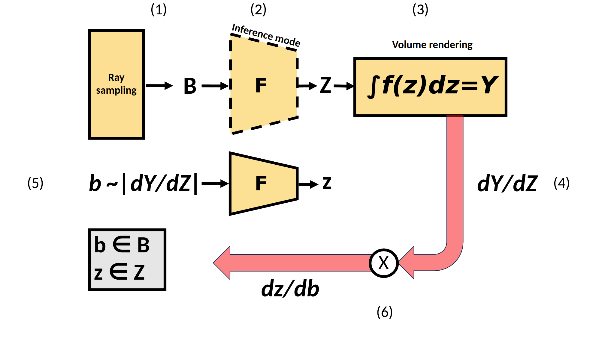

# HSM-NeRF : Hard Sample Mining (HSM) in NeRF Optimization

This is the code for the paper, "Efficient NeRF Optimization - Not All Samples Remain Equally Hard", published in European Conference on Computer Vision (ECCV), 2024.

The code is modified and based on [torch-ngp](https://github.com/ashawkey/torch-ngp) and [nerf-template](https://github.com/ashawkey/nerf_template),focusing on static NeRF reconstruction of realistic scenes. 

The original code is under MIT Lience. We, however, provide a modified code with our modifications under BSD3-Clause Licence. The modified files have a header with related licence term.

Using this code, please cite the following publication 

```
@InProceedings{10.1007/978-3-031-72764-1_12,
    author="Korhonen, Juuso
    and Rangu, Goutham
    and Tavakoli, Hamed R.
    and Kannala, Juho",
    title="Efficient NeRF Optimization - Not All Samples Remain Equally Hard",
    booktitle="Computer Vision -- ECCV 2024",
    year="2025",
}
```

### Essential idea:

1. Forward pass B samples (in no_grad mode)
2. Draw b samples from B (b << B, dynamic size) proportionally to the |gradient of the pixel loss w.r. preactivation network output layer| (L2 norm)
3. Second forward pass with b samples, building the computational graph
4. Backward pass the b samples

(Instead of the baseline:

1. Forward pass B samples
2. Backward pass the B samples

)

HSM implemented in NeRF pipeline:



Notice how we only have to repeat the network processing as this is the only parametrized module (Note: related to pixel loss, proposal networks with Nerfacto form a separate computational graph).

This effectively prunes low-gradient samples from time and memory expensive backpropagation. Subsequently this allows more resource allocation for high-gradient samples.
High-gradient sample = high loss sample & high weight sample. So this strategy effectively targets the intersection of the two separate groups identified by previous importance sampling methods with NeRFs: high loss (pixel sampling) and high weight (ray sampling) samples.

### Visualized Results

We trained the Instant-NGP model of this repository for 4 minutes for the bonsai dataset (scripts/run_vis.sh).

During training time, we see our hard sample mining reducing the iteration time and memory usage drastically to about 50% of the baseline. The memory usage is the same as running the network in inference mode. (However, there are still regular memory peaks coming from updating the occupancy grid)

We plot the validation image rendering over the 4 minutes of training for the bonsai dataset:


Test performance (baseline on left vs HSM on the right):


This essentially means that our hard sample mining reaches higher visual quality with limited training compute resources (time and memory).

### Potential Applications

As our method only interfaces with the commonly shared modules of NeRF pipeline, we expect that it is easy to integrate with other NeRF models. We see creating a hard sample mining pipeline in Nerfstudio as a natural continuation for the project.

We see that specifically the following models could make use of our pipeline: mip-nerf-360, neuralangelo, nerfplayer, 3D gaussian splatting (3dgs); These models have either lengthy training times, high memory usage or both. For mip-nerf-360, neuralangelo, and nerfplayer the usage should be straightforward. Although 3dgs moves away from the neural aspect, we see that our method might be still applicable to it - HSM might allow to use automatic differentiation instead of the complicated explicit process deviced to reduce memory overhead.

# Installation 


After cloning this repository follow the below instructions we recommend using apptainer and the hsm.def to run the exact same environment of the test.

### Apptainer container useage

First build the image using the following command: 
```
apptainer build hsm.sif hsm.def
```

Once the container image is built run the following command to install the external dependencies: 

```
apptainer exec --nv hsm.sif bash scripts/install_ext.sh
```

Running the code using apptainer is fairly simple:

```
export APPTAINERENV_CUDA_VISIBLE_DEVICES=0
apptainer exec --nv hsm.sif python3 main.py data/bonsai/ --workspace trial_ngp_bonsai -O --hsm # + additional options
```


### Installation using virtaul environments and pip

```bash
pip install -r requirements.txt
```

### Build extension (optional)
By default, we use [`load`](https://pytorch.org/docs/stable/cpp_extension.html#torch.utils.cpp_extension.load) to build the extension at runtime.
However, this may be inconvenient sometimes.
Therefore, we also provide the `setup.py` to build each extension:
```bash
# install all extension modules
bash scripts/install_ext.sh

# if you want to install manually, here is an example:
cd raymarching
python setup.py build_ext --inplace # build ext only, do not install (only can be used in the parent directory)
pip install . # install to python path (you still need the raymarching/ folder, since this only install the built extension.)
```

### Tested environments
* Ubuntu 24.04 & apptainer 1.3.6 containerized version of the code on a RTX A5000 
* Ubuntu 22.04 with torch 1.13 & CUDA 11.7 on a RTX A5000.
* Ubuntu 22 with torch 1.12 & CUDA 11.6 on a V100.

# Usage

We majorly support COLMAP dataset like [Mip-NeRF 360](http://storage.googleapis.com/gresearch/refraw360/360_v2.zip).
Please download and put them under `./data`.

For custom datasets:
```bash
# prepare your video or images under /data/custom, and run colmap (assumed installed):
python scripts/colmap2nerf.py --video ./data/custom/video.mp4 --run_colmap # if use video
python scripts/colmap2nerf.py --images ./data/custom/images/ --run_colmap # if use images
```

### Basics

Activating the hard sample mining during training is as easy as specifying --hsm in the run command:

```
# instant-ngp
python main.py data/bonsai/ --workspace trial_ngp_bonsai -O --hsm # + additional options

# nerfacto
python main.py data/room/ --workspace trial_nerfacto_room -O2 --hsm # + additional options
```


First time running will take some time to compile the CUDA extensions.
```bash
## -O: instant-ngp
# prune sampling points by maintaining a density grid
python main.py data/bonsai/ --workspace trial_bonsai_ngp --enable_cam_center --downscale 4 -O --background random --bound 8

## -O2: nerfstudio nerfacto
# use proposal network to predict sampling points
python main.py data/bonsai/ --workspace trial_bonsai_nerfacto --enable_cam_center --downscale 4 -O2

# MeRF network backbone
python main.py data/bonsai/ --workspace trial_bonsai_nerfacto --enable_cam_center --downscale 4 -O2 --backbone merf
```

### Advanced Usage
```bash
### -O: equals
--fp16 --preload
--cuda_ray --mark_untrained
--adaptive_num_rays --random_image_batch

### -O2: equals
--fp16 --preload
--contract --bound 128
--adaptive_num_rays --random_image_batch 

### load checkpoint
--ckpt latest # by default we load the latest checkpoint in the workspace
--ckpt scratch # train from scratch.
--ckpt trial/checkpoints/xxx.pth # specify it by path

### training
--num_rays 4096 # number of rays to evaluate per training step
--adaptive_num_rays # ignore --num_rays and use --num_points to dynamically adjust number of rays.
--num_points 262144 # targeted number of points to evaluate per training step (to adjust num_rays)

### testing
--test # test, save video and mesh
--test_no_video # do not save video
--test_no_mesh # do not save mesh

### dataset related
--data_format [colmap|nerf] # dataset format
--enable_cam_center # use camera center instead of sparse point cloud center as the scene center (colmap dataset only) (only for 360-degree captured datasets, do not use this for forward-facing datasets!)
--enable_cam_near_far # estimate camera near & far from sparse points (colmap dataset only)

--bound 16 # scene bound set to [-16, 16]^3.
--scale 0.3 # camera scale, if not specified, automatically estimate one based on camera positions.

### visualization 
--vis_pose # viusalize camera poses and sparse points (sparse points are colmap dataset only)
--gui # open gui (only for testing, training in gui is not well supported!)

### balance between surface quality / rendering quality

# increase these weights to get better surface quality but worse rendering quality
--lambda_tv 1e-7 # total variation loss
--lambda_entropy 1e-3 # entropy on rendering weights (transparency, alpha), encourage them to be either 0 or 1
```

# Citation

Using this code, please cite the following publication:
  
```
@InProceedings{10.1007/978-3-031-72764-1_12,
    author="Korhonen, Juuso
    and Rangu, Goutham
    and Tavakoli, Hamed R.
    and Kannala, Juho",
    title="Efficient NeRF Optimization - Not All Samples Remain Equally Hard",
    booktitle="Computer Vision -- ECCV 2024",
    year="2025",
}
```

# License

The content of this repository is licensed with the BSD-3-Clause-Clear license. For the full text of the license consult
with the [LICENSE](LICENSE) file. 

The origin of the codebase is [ashawkey/torch-ngp](https://github.com/ashawkey/torch-ngp) what is licensed with the
[MIT](https://github.com/ashawkey/torch-ngp/blob/main/LICENSE) license. 